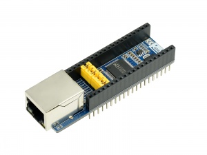

# pico-eth-ch9121

MicroPython library for Waveshare [pico-eth-ch9121](https://www.waveshare.com/wiki/Pico-ETH-CH9121) Raspberry Pi Pico hat.

## Examples

All examples are in [examples](./examples) folder. Some examples might contain README files which should help you to get started.

- [tcp-client-dhcp](./examples/tcp-client-dhcp/README.md): send simple HELLO message to TCP Server. DHCP is configured in this example.

